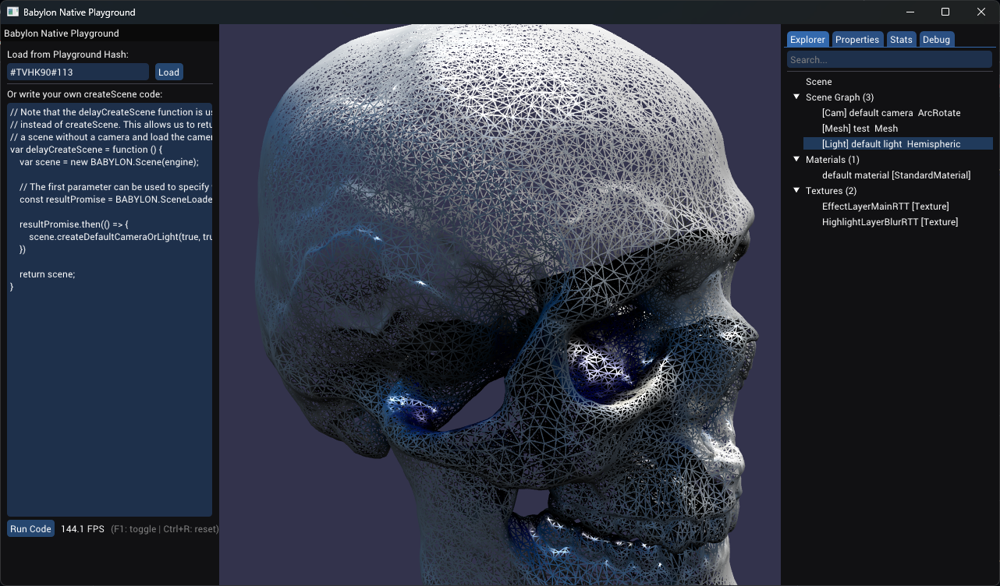

# Babylon Native Playground

A cross-platform C++ showcase application demonstrating how [Babylon Native](https://github.com/BabylonJS/BabylonNative) can be integrated into a native project. The app replicates the functionality of the [Babylon.js Playground](https://playground.babylonjs.com/) in a fully native environment, illustrating bidirectional communication between JavaScript and C++ — scene logic runs in JS via Babylon.js, while the UI and tooling are rendered natively using [ImGui](https://github.com/ocornut/imgui).



## Purpose

This project demonstrates:

- **JS ↔ C++ data exchange** — Scene data is serialized in JavaScript into a compact binary buffer and sent to C++ for display. User edits made in the C++ ImGui inspector are serialized back and dispatched to JavaScript to update the scene in real time.
- **Native scene inspector** — A full-featured ImGui inspector (Scene Explorer, Properties, Stats, Debug) that mirrors the capabilities of the browser-based [Babylon.js Inspector](https://doc.babylonjs.com/toolsAndResources/inspector).
- **Playground compatibility** — Load any [Babylon.js Playground](https://playground.babylonjs.com/) snippet by hash, view and edit the source code, and run it natively.
- **Hybrid architecture** — Rendering and scene management happen in JavaScript through Babylon.js, while windowing (SDL3), input handling, and developer tooling live in C++.

## Features

- **Playground loader** — Enter a playground hash (e.g. `#QCU8DJ`) to fetch and run any public snippet
- **Code editor** — Built-in ImGui text editor to write and execute `createScene` code
- **Scene Explorer** — Hierarchical tree view of the full scene graph (meshes, cameras, lights, nodes) with search and selection highlighting
- **Properties panel** — Edit transforms, colors, materials, camera settings, light parameters, and more — changes apply to the live scene instantly
- **Stats panel** — FPS graph, draw calls, vertex/face counts, frame step timings, and engine info
- **Debug panel** — Toggle grid, bounding boxes, world axes, texture channels, and scene features (animations, fog, shadows, etc.)
- **Animation controls** — Play/pause/stop animation groups with speed and frame scrubbing

## Prerequisites

- **CMake** 3.21 or later
- **Node.js** and **npm**
- **C++17 compiler**

### Platform-specific requirements

**Windows:**
- Visual Studio 2019 or later with the "Desktop development with C++" workload

**macOS:**
- Xcode 12 or later

**Linux:**
```bash
sudo apt-get install libxi-dev libxcursor-dev libxinerama-dev libxrandr-dev \
    libgl1-mesa-dev libcurl4-openssl-dev clang-9 libc++-9-dev libc++abi-9-dev \
    lld-9 ninja-build libv8-dev
```

## Getting Started

### 1. Clone the repository

```bash
git clone --recursive https://github.com/<your-username>/BabylonNativeOfflinePlayground.git
cd BabylonNativeOfflinePlayground
```

If you already cloned without `--recursive`:
```bash
git submodule update --init --recursive
```

### 2. Install npm dependencies

```bash
npm install
```

### 3. Build

**Windows (Visual Studio):**
```bash
mkdir build && cd build
cmake .. -G "Visual Studio 17 2022"
cmake --build . --config Release
```

**macOS (Xcode):**
```bash
mkdir build && cd build
cmake .. -G "Xcode"
cmake --build . --config Release
```

**Linux (Ninja):**
```bash
mkdir build && cd build
cmake -G Ninja -DNAPI_JAVASCRIPT_ENGINE=V8 ..
ninja
```

### 4. Run

**Windows:**
```bash
.\build\Release\BabylonNativePlayground.exe
```

**macOS / Linux:**
```bash
./build/Release/BabylonNativePlayground
```

## Controls

| Input | Action |
|---|---|
| **Left mouse** | Rotate camera |
| **Right mouse** | Pan camera |
| **Scroll wheel** | Zoom in/out |
| **F1** | Toggle ImGui overlay |
| **Ctrl+R** | Reinitialize engine |

## Architecture

```
  ┌──────────────────┐       Binary buffer (JS→C++)       ┌──────────────────┐
  │   JavaScript     │  ──────────────────────────────►    │      C++         │
  │                  │   Scene data: nodes, meshes,        │                  │
  │  Babylon.js API  │   materials, lights, stats          │  ImGui Inspector │
  │  Scene logic     │                                     │  SDL3 Window     │
  │  Asset loading   │  ◄──────────────────────────────    │  Input handling  │
  │                  │   Command buffer (C++→JS)           │                  │
  └──────────────────┘   Property edits, debug toggles     └──────────────────┘
```

## Project Structure

```
├── Documentation/
│   └── Images/              # Screenshots
├── Dependencies/
│   ├── BabylonNative/       # Git submodule — engine runtime
│   ├── SDL/                 # Git submodule — windowing & input
│   ├── imgui/               # Git submodule — immediate-mode UI
│   └── CMakeLists.txt
├── Scripts/
│   └── game.js              # Scene serialization, command handling, playground loader
├── CMakeLists.txt           # Root build configuration
├── CMakePresets.json         # Build presets
├── SceneInspector.h         # ImGui inspector — parsing, tree, properties, stats, debug
├── main.cpp                 # App entry point — SDL3 loop, N-API bridge, command dispatch
├── package.json             # npm dependencies (babylonjs, loaders, materials)
└── README.md
```

## License

This project is provided as-is for educational purposes. [Babylon Native](https://github.com/BabylonJS/BabylonNative) is licensed under the [Apache 2.0 License](https://github.com/BabylonJS/BabylonNative/blob/master/LICENSE.md). [SDL3](https://www.libsdl.org/) is licensed under the [zlib License](https://www.libsdl.org/license.php). [Dear ImGui](https://github.com/ocornut/imgui) is licensed under the [MIT License](https://github.com/ocornut/imgui/blob/master/LICENSE.txt).
